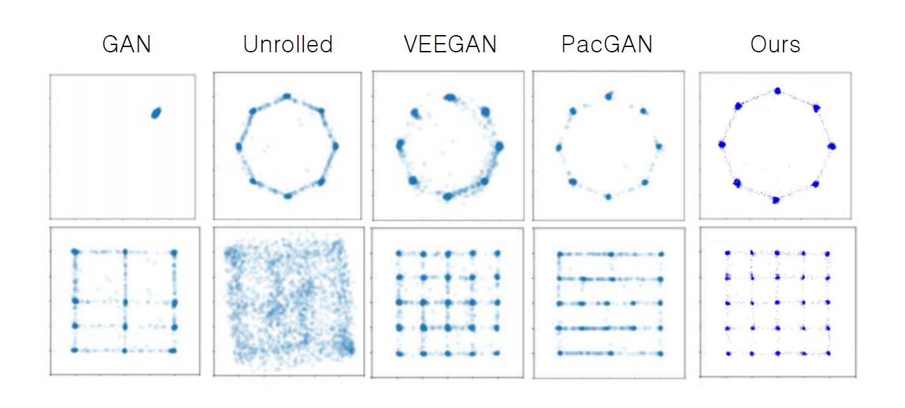

# NDiv for 5x5 Gaussian

The code is based on the [BourGAN](https://arxiv.org/abs/1805.07674) implementation at https://github.com/a554b554/BourGAN.
To reproduce the experiments on the Gaussian grid:
```
python train.py --cfg config_grid
```
To reproduce the experiments on the Gaussian ring:
```
python train.py --cfg config_ring
```
Results will be saved in the folder `output`. You can modify the configuration files in the folder `configs`.


